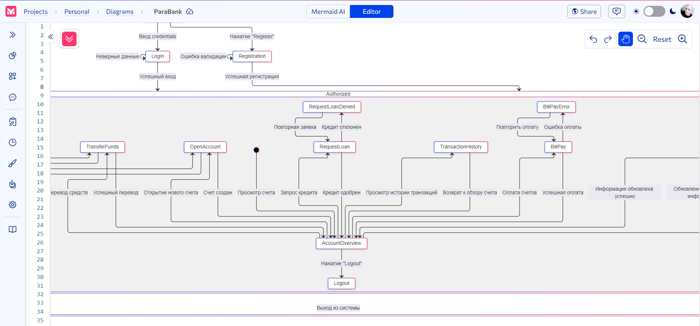

# ParaBank Automated Testing Project

[](https://github.com/ZhikharevAl/ParaBank/actions/workflows/ruff_check.yml)
[](https://github.com/ZhikharevAl/ParaBank/actions/workflows/auto_tests.yml)

## Table of Contents

- [Project Description](#project-description)
- [Project Structure](#project-structure)
- [State Diagram](#state-diagram)
- [Main Functions](#main-functions)
- [Technologies and Tools](#technologies-and-tools)
- [Environment Setup](#environment-setup)
- [Running Tests](#running-tests)
- [Report Structure](#report-structure)
- [Project Features](#project-features)

## Project Description

This project is a collection of automated tests for the Parabank web application. The tests cover core functionalities such as user registration, authorization, account viewing, transactions, and other actions supported by the website.

## Project Structure

```bash
parabank/
│
├── .github/               # GitHub Actions configurations
│   ├── workflows/
│       ├── auto_tests.yml
│       ├── ruff_check.yml
├── config/                # Configuration settings
├── data/                  # Modules for test data handling
│   ├── __init__.py
│   ├── user_data.py
├── docs/                  # Documentation
├── pages/                 # Page Object models for Parabank website pages
│   ├── __init__.py
│   ├── base_page.py
│   ├── main_page.py
│   ├── overview_page.py
│   ├── register_page.py
├── tests/                 # Test modules
│   ├── base/
│       ├── __init__.py
│       ├── base_test.py
│   ├── ui/
│       ├── __init__.py
│       ├── test_ui_elements.py
│       ├── test_login.py
│       ├── test_main_parabank.py
│       ├── test_register.py
├── .gitignore
├── conftest.py           # PyTest configuration
├── pyproject.toml        # Ruff configuration
├── pytest.ini           # PyTest configuration
├── README.md
├── requirements.txt      # Project dependencies
```

## [State Diagram](./attachment/Untitled%20diagram-2024-10-19-004955.svg)




## Main Functions

- New user registration with various valid and invalid data
- Registered user authorization
- Viewing account balance, transaction history, and user information
- Verification of UI elements display correctness

## Technologies and Tools

- Python
- Pytest
- Allure for reporting
- Playwright for UI interaction
- Page Object Model for test structuring
- GitHub Actions for CI/CD

## Environment Setup

1. Ensure Python 3.10+ is installed
2. Clone the repository:

   ```bash
   git clone https://github.com/ZhikharevAl/ParaBank.git
   cd ParaBank
   ```

3. Create and activate a virtual environment:

   ```bash
   uv venv .venv
   source .venv/bin/activate  # For Linux/Mac
   .venv\Scripts\activate    # For Windows
   ```

4. Install dependencies:

   ```bash
   uv pip install --upgrade -r requirements.txt
   ```

## Running Tests

To run all tests:

```bash
pytest
```

To run a specific test:

```bash
pytest tests/ui/test_ui_elements.py
```

To generate an Allure report:

```bash
pytest --alluredir=./allure-results
allure serve ./allure-results
```

## Report Structure

The project uses Allure for report generation. Each test includes:

- Detailed step description
- Screenshots on failures
- Test priority level

## Project Features

- Use of Page Object Model for code structuring
- Test parameterization for different scenario coverage
- CI/CD support through GitHub Actions for automatic test execution
- Test categorization for better coverage